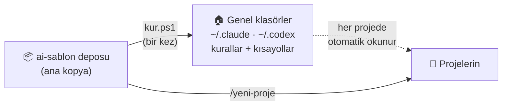
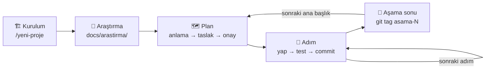

# 🧭 ai-sablon

**Claude Code ve OpenAI Codex'i dönüşümlü kullanırken hiçbir bilgi kaybolmasın diye kurulmuş
çalışma düzeni.** Kişisel kurallar, proje belgeleri, kısayollar ve küçük betikler; hepsi tek depoda.

`🇹🇷 Türkçe` · `🪟 Windows + PowerShell 5.1` · `🤖 Claude Code` · `🤖 OpenAI Codex`

> [!NOTE]
> **👥 Kimin için?** Claude Code ve/veya Codex kullanan, Windows'ta çalışan, Türkçe konuşan
> geliştiriciler. Kurallar, belgeler ve yapay zekâyla iletişim Türkçedir.
> Git'i (`git init`, commit, push) **sen** yönetirsin; şablon Git'e dokunmaz.

> [!WARNING]
> `scripts\kur.ps1` bilgisayarındaki genel yapay zekâ ayarlarına yazar (`~\.claude`, `~\.codex`,
> `~\.agents`). Değiştirdiği her şeyi önce **yedekler**; yine de önce `-Kontrol` ile ne yapacağını
> gör. Kendi sorumluluğunda kullan.

---

## 📑 İçindekiler

- [✨ Ne işe yarar?](#-ne-işe-yarar)
- [🗺️ Nasıl çalışır?](#️-nasıl-çalışır)
- [🚀 Hızlı başlangıç](#-hızlı-başlangıç)
- [📘 Kullanım kılavuzu](#-kullanım-kılavuzu)
  - [1️⃣ Bilgisayara kurulum](#1️⃣-bilgisayara-kurulum-bir-kez)
  - [2️⃣ Yeni proje açma](#2️⃣-yeni-proje-açma)
  - [3️⃣ Araştırma ve plan](#3️⃣-araştırma-ve-plan)
  - [4️⃣ Günlük çalışma](#4️⃣-günlük-çalışma-adım-adım)
  - [5️⃣ Araç değiştirme](#5️⃣-araç-değiştirme-claude--codex)
  - [6️⃣ Aşama sonu](#6️⃣-aşama-sonu)
- [⌨️ Kısayollar](#️-kısayollar)
- [📂 Projede oluşan dosyalar](#-projede-oluşan-dosyalar)
- [🛡️ Güvenlik ve koruma](#️-güvenlik-ve-koruma)
- [❓ Sorun giderme](#-sorun-giderme)
- [🛠️ Özelleştirme](#️-özelleştirme)
- [⚠️ Bilinen sınırlar](#️-bilinen-sınırlar)

---

## ✨ Ne işe yarar?

| 😩 Sorun | ✅ ai-sablon'un çözümü |
|---|---|
| Limit dolunca diğer araca geçiyorum, nerede kaldığımı anlatmak zorunda kalıyorum | `/devir` devir notunu yazar, yeni araçta `/basla` okur ve özetler |
| "Türkçe konuş, `git add .` kullanma, imza ekleme" gibi kuralları her projede yeniden yazıyorum | Kişisel kurallar **bir kez** kurulur, her projede geçerli olur |
| Her yeni projede belge düzenini baştan kuruyorum | `/yeni-proje` dakikalar içinde kurar |
| Plan proje ilerledikçe sürekli değişiyor | Araştırma → anlama → plan akışı, riskli varsayımları **en başta** sınar |
| Yapay zekâ commit'lere kendi imzasını ekliyor | Ayar + kural + **Git kancası**: imzalı commit Git tarafından reddedilir |
| Yapay zekâ bir anda bütün planı yapmaya kalkıyor | Çalışma birimi **tek adım**: 1.1 biter, commit önerilir, durur |

---

## 🗺️ Nasıl çalışır?

Üç yer var:



1. **📦 Bu depo:** Her şeyin ana kopyası. Değişiklik yalnızca burada yapılır.
2. **🏠 Genel klasörler** (`~` = `C:\Users\<ad>`): `kur.ps1` kişisel kuralları ve kısayolları
   buraya kopyalar. Claude ve Codex bunları **her projede** kendiliğinden okur.
3. **📁 Her proje:** `/yeni-proje` projeye belge düzenini kurar.

Bir projenin hayatı:



---

## 🚀 Hızlı başlangıç

> İlk kez mi kullanıyorsun? Bu beş adım yeter. Ayrıntılar [kullanım kılavuzunda](#-kullanım-kılavuzu).

```powershell
# 1) Depoyu indir (adres: GitHub sayfasındaki yeşil "Code" düğmesi)
git clone <bu-deponun-adresi> ai-sablon
cd ai-sablon

# 2) Kişisel ayarını oluştur, sonra yerel.json'u açıp kendi bilgilerini yaz
Copy-Item yerel.ornek.json yerel.json

# 3) Önce kuru çalıştır: hiçbir şey yazmaz, ne yapacağını gösterir
powershell -NoProfile -ExecutionPolicy Bypass -File scripts\kur.ps1 -Kontrol

# 4) Kur
powershell -NoProfile -ExecutionPolicy Bypass -File scripts\kur.ps1
```

5. Claude Code'da **yeni bir oturum** aç, Codex'i yeniden başlat. Boş bir klasörde `/yeni-proje` yaz. 🎉

---

## 📘 Kullanım kılavuzu

### 1️⃣ Bilgisayara kurulum (bir kez)

**🧰 Gerekenler**

| | |
|---|---|
| 🪟 Windows 10/11 | PowerShell 5.1 Windows'la birlikte gelir |
| 🌱 Git | `git --version` çalışmalı |
| 🤖 Claude Code ve/veya Codex | VS Code eklentisi, masaüstü uygulaması ya da terminal |
| 🐍 Python (isteğe bağlı) | Yalnızca Python projeleri için (`python-windows` eki) |

**🔧 Adımlar**

1. **Kişisel ayar:** `yerel.ornek.json`'u `yerel.json` adıyla kopyala ve doldur:

   ```json
   {
     "kullanici": "GitHub-kullanici-adin",
     "tanitim": "kısa tanıtım (boş bırakılabilir)",
     "korunanKlasorler": ["C:\\Users\\ad\\Desktop\\dokunulmayacak-proje"]
   }
   ```

   - `kullanici` ve `tanitim` kurallara yazılır ("Yazar yalnız kullanıcıdır…").
   - `korunanKlasorler`: yapay zekânın **asla kurulum yapmayacağı** klasörler (ör. eski, önemli bir proje).
   - `yerel.json` Git'e girmez. Dosya yoksa ad `git config --global user.name`'den alınır.

2. **Kuru çalıştırma** (hiçbir şey yazmaz):

   ```powershell
   powershell -NoProfile -ExecutionPolicy Bypass -File scripts\kur.ps1 -Kontrol
   ```

   Her hedef için bir durum görürsün:

   | Durum | Anlamı |
   |---|---|
   | 🆕 `YENİ` | Dosya yok, oluşturulacak |
   | 📭 `BOŞ` | Dosya var ama boş, doldurulacak |
   | ✅ `AYNI` | Zaten güncel, dokunulmayacak |
   | ✏️ `FARKLI` | Değişmiş; yedeklenip güncellenecek |
   | 🚫 `YABANCI` | ai-sablon'a ait değil, **atlanacak** (`-Zorla` ile ezilebilir) |
   | 💥 `BOZUK` | `settings.json` geçerli JSON değil, **dokunulmayacak** |

3. **Kurulum:**

   ```powershell
   powershell -NoProfile -ExecutionPolicy Bypass -File scripts\kur.ps1
   ```

   | Ne | Nereye |
   |---|---|
   | 📜 Kişisel kurallar (`genel\KURALLAR.md`) | `~\.claude\CLAUDE.md` ve `~\.codex\AGENTS.md` |
   | ⌨️ Dört kısayol (`skills\`) | `~\.claude\skills\` ve `~\.agents\skills\` |
   | ⚙️ İmza kapatma (`attribution`) | `~\.claude\settings.json` (diğer ayarların korunur) |
   | 💾 Yedekler | Dosyaların yanına `.yedek-<tarih>`; skill'ler `~\.ai-sablon-yedek\` |

4. Claude Code'da **yeni oturum** aç, Codex'i **yeniden başlat**. Yazarken `/` (Claude) ya da `$`
   (Codex) yazınca `basla`, `devir`, `karar`, `yeni-proje` görünmeli. ✅

> [!TIP]
> Codex masaüstü uygulaması kısayolları görmezse: `kur.ps1 -CodexSkillKlasoru $HOME\.codex\skills`
> ile yeniden kur (iki yere birden kurma, kısayollar çift görünür).

---

### 2️⃣ Yeni proje açma

1. 📁 Boş bir klasör aç, içinde Claude Code ya da Codex'i başlat.
2. ⌨️ `/yeni-proje` yaz. Yalnızca iki şey sorar:
   - **Proje adı** (boş bırakırsan klasör adı)
   - **Kafandaki ilk fikir** (1-3 cümle)
3. ✅ Özeti onayla. Dosyalar kurulur, boş `docs\arastirma\genel\` klasörü açılır.
4. 🌱 Git'i **sen** kurarsın:

   ```powershell
   git init -b main
   git config user.email "<kullanici-adin>@users.noreply.github.com"   # gerçek e-postan görünmesin
   git config core.hooksPath .githooks                                  # imza kancasını açar
   ```

5. ☁️ GitHub'da **boş** bir repo aç (README/.gitignore/lisans işaretleme), adresini ekle:

   ```powershell
   git remote add origin <repo-adresi>
   ```

> [!NOTE]
> Şablon deposunun içine, ev klasörüne, Masaüstü köküne ve `yerel.json`'daki korunan
> klasörlere kurulum **yapılmaz**.

---

### 3️⃣ Araştırma ve plan

**🔎 Araştırma**

- İlk araştırmanın sonuçlarını (ör. deep research raporları) `docs\arastirma\genel\` klasörüne koy.
- Sonradan bir ana başlık için araştırma yaparsan yapay zekâya **"araştırma ekleyeceğim"** de:
  o aşamanın klasörünü (`asama-2\` gibi) açıp yolunu söyler. Dosyanın yerini verirsen kendisi kopyalar.
- 🔒 Araştırma belgelerine gizli bilgi (şifre, anahtar) koyma.

**🗺️ Plan** — Plan modunda şunu yaz:

> araştırmaya göre projenin planını çıkar

İki kontrol noktası vardır:

| | Yapay zekâ ne gösterir? | Sen ne yaparsın? |
|---|---|---|
| **1. Anlama** | Gereksinimler (etiketli), başarı ölçütleri, belgeyle çelişkiler, yalnızca planı değiştirecek sorular | Soruları cevapla, düzelt |
| **2. Plan taslağı** | Ana başlıklar (amaç, "bitti" = komut/test, bağımlılık), önemli kararlar, varsayımlar | Onayla → `PLAN.md`'ye yazılır |

Etiketler: `[B]` belgeden · `[Ö]` yapay zekânın önerisi · `[V]` varsayım. Yapay zekâ belgeye
**körü körüne uymaz**; daha iyisini görürse önerir ama nereden geldiğini gösterir.

- 🦴 **İlk ana başlık** ince bir uçtan uca iskelettir: riskli varsayımları gerçek kodla **en başta** sınar.
- 🔭 **Uzak başlıklar** kaba kalır. Her ana başlığa geçerken **"2. başlığı planla"** dersin, o zaman
  adımlara (2.1, 2.2…) bölünür.
- 🐍 Teknoloji Python çıkarsa `python-windows` eki önerilir (test, biçim, CI, `.env.example`).
- 🧐 İstersen planı **yeni bir oturumda ya da Codex'te** eleştirt. Aynı sohbette eleştirmek işe yaramaz.

---

### 4️⃣ Günlük çalışma (adım adım)

Örnek bir oturum:

```text
Sen:  /basla
AI:   Dal main, son commit abc123. Şu an: Aşama 1, adım 1.2 (bekliyor).
      Bekleyen karar yok. Onayını bekliyorum.
Sen:  1.2'yi yap
AI:   (kodu yazar, testleri çalıştırır, hatayı düzeltir)
      1.2 bitti: ... Commit önerisi: 3 dosya, mesaj "1.2: ...". Onaylıyor musun?
Sen:  evet
AI:   Commit atıldı. Push edeyim mi?
Sen:  evet
Sen:  /devir
```

| Kural | Ne demek? |
|---|---|
| 🎯 Birim tek adımdır | 1.1 baştan sona biter (kod, test, düzeltme), commit önerilir, **durur**. 1.2'ye sen söylemeden geçmez. |
| ✋ Kontrol noktaları | Adım ortasında yalnızca şunlarda sorar: plan dışı iş, yeni paket, `.env`, biten aşamanın arayüzü, düzeltemediği test, geri alınması zor komut |
| ✅ Commit ve push | Dosya listesi + Türkçe mesaj gösterilir, **onayınla** commit; push için ayrıca sorulur |
| 🧪 Testler | Her adımda **bütün** testler çalışır; eski aşamanın testi kırılırsa adım bitmiş sayılmaz |
| 📝 Kararlar | Yolda bir karar verirsen `/karar Şunu seçtik, çünkü …` |

---

### 5️⃣ Araç değiştirme (Claude ↔ Codex)

1. 🔚 Çalışan araçta: **`/devir`** (Codex'te `$devir`). Cevabı bekle.
2. 🆕 Diğer araçta **yeni sohbet** aç: **`/basla`** (`$basla`).
3. ⚡ Limit birden bittiyse: `/basla devir notu yazılamadı` — yapay zekâ değişikliklerden kendisi kurar.

> [!IMPORTANT]
> İki aracı **aynı anda** çalıştırma. Bir araca geri dönerken eski sohbeti sürdürme, yeni sohbet aç.

Ayrıntılı rehber ve kısayollar görünmezse yedek mesajlar: 👉 [ARAC_GECISI.md](ARAC_GECISI.md)

---

### 6️⃣ Aşama sonu

- 🏁 Aşamanın bütün adımları bitince testler geçer, yapay zekâ commit ve `git tag asama-1` önerir.
- 🧊 Biten aşamanın **dışa açık arayüzü ve testleri donar**. İçinde hata düzeltmek serbesttir
  (testler yeşil kaldıkça); arayüz değişecekse sana **sade dille** sorulur.
- ➡️ Sonraki ana başlık için: **"N. başlığı planla"**.

---

## ⌨️ Kısayollar

| Ne zaman | 🟠 Claude | 🟢 Codex |
|---|---|---|
| ▶️ Oturum başında | `/basla` | `$basla` |
| ⏹️ Oturum sonunda ya da araç değiştirirken | `/devir` | `$devir` |
| 📝 Bir karar verdiğinde | `/karar metin` | `$karar metin` |
| 🏗️ Yeni projede, bir kez (yalnızca elle) | `/yeni-proje` | `$yeni-proje` |

---

## 📂 Projede oluşan dosyalar

| Dosya | Git | Ne işe yarar? |
|---|---|---|
| 📜 `AGENTS.md` | ✅ | Yalnızca bu projenin kuralları, belge haritası, planlama kuralı |
| 🗺️ `PLAN.md` | ✅ | Başarı ölçütleri, aşamalar, şu anki adımlar, varsayımlar, sürprizler (~100-150 satır) |
| ⚖️ `KARARLAR.md` | ✅ | Gerekçeli kararlar (`K-001`…); yalnızca eklenir |
| 📓 `GUNLUK.md` | ✅ | Biten adım ve kararların kısa kaydı |
| 🔄 `DEVAM.md` | ❌ | "Şu an" durumu; her `/devir`'de baştan yazılır (≤60 satır) |
| 🔗 `CLAUDE.md` | ❌ | Claude'a `AGENTS.md`, `PLAN.md`, `DEVAM.md`'yi yükletir |
| 🩺 `.ai/durum.ps1` | ✅ | Oturum başında devir notunun güncelliğini denetler |
| 🪝 `.githooks/commit-msg` | ✅ | Yapay zekâ imzalı commit'i reddeder |
| ⚙️ `.claude/settings.json` | ✅ | İzinler, imza kapatma, oturum başı kancası |
| 🔎 `docs/arastirma/` | ✅ | `genel/` ilk araştırma, `asama-N/` başlığa özel araştırma |

<details>
<summary>🩺 Oturum başı uyarı kodları (U1–U6)</summary>

Claude Code'da her oturum başında `.ai/durum.ps1` çalışır; Codex'te aynı denetim `$basla` içinde
yapılır. Uyarı varsa yapay zekâ **ilk cevabında** söylemelidir.

| Kod | Anlamı | Ne yapmalı? |
|---|---|---|
| U1 | Devir notu yok | `/devir` |
| U2 | Devir notundaki tarih okunamadı | `/devir` |
| U3 | Son commit devir notundan yeni | `/devir` (commit'ten sonra normaldir) |
| U4 | Commit edilmemiş bir dosya devir notundan yeni | `/devir` |
| U5 | Devir notu 60 satırdan uzun | Kısaltılmalı |
| U6 | Devir notunun tarihi gelecekte | Saat ya da tarih yanlış |

Elle çalıştırmak için (salt okunur):

```powershell
powershell -NoProfile -ExecutionPolicy Bypass -File scripts\durum.ps1 -Proje <klasör>
```

</details>

---

## 🛡️ Güvenlik ve koruma

| Koruma | Nasıl? |
|---|---|
| 🪝 **İmzasız commit** | Ayar (`attribution`) + kural + Git kancası. Kanca iki araçta da çalışır, en güvenilir katman. |
| 🚫 **Yasak komutlar** | `git add .`, `git add -A`, `git push --force`, `--no-verify`, `.env` okuma |
| ❓ **Onay isteyenler** | `git push`, `git reset --hard`, `git clean`, özyinelemeli silme |
| 🔒 **Korunan klasörler** | `yerel.json`'daki klasörlere kurulum yapılmaz, yapay zekâ yazmaz |
| 💾 **Yedek** | `kur.ps1` değiştirdiği her dosyayı önce yedekler |
| 🙋 **Git kimliği** | Yapay zekâ `git config` yazmaz; deposu, uzak adresi ve kimliği sen kurarsın |

> [!CAUTION]
> İzin kuralları bir güvenlik **sınırı** değildir; komut varyasyonlarıyla aşılabilir. İzin
> sorulduğunda okuyup **tek seferlik "Yes"** de; "don't ask again" seçme.

---

## ❓ Sorun giderme

<details>
<summary>⌨️ Kısayollar (<code>/basla</code> vb.) görünmüyor</summary>

1. Claude Code'da **yeni bir oturum** aç; Codex'i tamamen kapatıp aç.
2. `kur.ps1 -Kontrol` çalıştır: skill'ler `AYNI` değilse `kur.ps1`'i çalıştır.
3. Codex'te `$` ya da `/skills` yaz. Görünmüyorsa `-CodexSkillKlasoru $HOME\.codex\skills` ile kur.
4. Olmazsa [ARAC_GECISI.md](ARAC_GECISI.md)'deki yedek mesajları kopyala-yapıştır.

</details>

<details>
<summary>💥 "Settings file failed to parse" uyarısı</summary>

Ayar dosyasında geçersiz bir değer var ve dosyanın **tamamı** yok sayılıyor. `kur.ps1`'i
yeniden çalıştır; `attribution` değerleri metin (`""`) olmalıdır, `false` değil. Dosyanın
yedeği `settings.json.yedek-<tarih>` olarak duruyor.

</details>

<details>
<summary>🪝 "commit-msg kancası etkin değil" bilgisi</summary>

Projede bir kez çalıştır:

```powershell
git config core.hooksPath .githooks
```

</details>

<details>
<summary>📋 VS Code'da <code>/memory</code> çalışmıyor</summary>

VS Code eklentisinde bu komut yok. Kuralların yüklendiğini görmek için Claude'a sor:
*"Hangi kullanıcı talimat dosyasını yükledin? Yolunu ve ilk başlığını aynen yaz."*

</details>

<details>
<summary>🤔 Yapay zekâ kurallara uymuyor (imza ekliyor, adım atlıyor)</summary>

- Hafif modeller (ör. Haiku) kurallara daha az uyar; **planlama için güçlü bir model** kullan
  (ör. `/model opusplan`).
- İmza için asıl koruma Git kancasıdır: `git config core.hooksPath .githooks`.

</details>

<details>
<summary>🧩 <code>yerel.json</code> okunamadı hatası</summary>

Dosya geçerli JSON değil. `yerel.ornek.json`'a bakarak düzelt (tırnaklar, virgüller,
Windows yollarında `\\`).

</details>

---

## 🛠️ Özelleştirme

<details>
<summary>📜 Kural değiştirme</summary>

Kişisel kuralların tek kaynağı `genel\KURALLAR.md`'dir.

1. `genel\KURALLAR.md`'yi düzenle (kişisel bilgi yazma; `__KULLANICI__` gibi yer tutucuları kullan).
2. `kur.ps1 -Kontrol`: değişen dosyalar `FARKLI` görünür.
3. `kur.ps1` çalıştır.

`~\.claude\CLAUDE.md` ya da `~\.codex\AGENTS.md`'yi **elle düzenleme**; sonraki kurulumda
yedeklenip ezilir. Projeye özel kurallar o projenin `AGENTS.md`'sine yazılır.

</details>

<details>
<summary>⌨️ Kısayol (skill) değiştirme</summary>

`skills\<ad>\SKILL.md`'yi düzenle, sonra `kur.ps1`. Aynı dosya Claude ve Codex'te çalışsın diye:

- Frontmatter'da yalnızca `name` (klasör adıyla aynı, `a-z0-9-`), `description`, `metadata`.
- Claude'a özgü öğe (`$ARGUMENTS`, `` !`komut` ``) yok.
- Kök yol `__SABLON_KOKU__`, sürüm `__SABLON_SURUM__`; `kur.ps1` doldurur.
- Belge adları sabit yazılmaz, projenin Belge haritasından okunur.
- Gövde 150 satırdan kısa; sonda "Bitti ölçütü" ve "Yapma".
- Yalnızca elle çağrılacaksa `metadata.yalniz-elle: "evet"`.

</details>

<details>
<summary>🧩 Yeni ek (dil/araç paketi) ekleme</summary>

`ekler\<ad>\` klasörü aç (`<ad>` yalnızca `a-z0-9-`). Dosyaların hepsi isteğe bağlıdır:

| Dosya | Ne olur? |
|---|---|
| `EK.md` | Ekin tanımı ve kurulumdan önce sorulacak sorular (hedefe kopyalanmaz) |
| `AGENTS.ek.md` | Hedef `AGENTS.md`'de `<!-- EKLER -->` işaretinin önüne eklenir |
| `izinler.ek.json` | İzin girdileri `.claude/settings.json`'a eklenir |
| `gitignore.ek` | Satırlar `.gitignore`'a tekrarsız eklenir |
| `dosyalar\` | Yol yapısıyla hedefe kopyalanır (ör. `ci.yml`, `.env.example`) |

Ek, planlamada teknoloji belli olunca kurulur; elle kurmak için:

```powershell
powershell -NoProfile -ExecutionPolicy Bypass -File <ai-sablon>\scripts\yeni-proje.ps1 -Hedef . -Ekler <ad>
```

</details>

<details>
<summary>🧱 Depo yapısı</summary>

```
ai-sablon\
├─ README.md               bu dosya
├─ AGENTS.md               bu depoda çalışan araca talimat (.sablon dosyaları talimat değildir)
├─ ARAC_GECISI.md          Claude ↔ Codex geçiş rehberi (kullanıcı için tek kopya)
├─ .gitignore              yedek dosyaları, yerel.json ve yerel ayar
├─ .gitattributes          şablondaki Git kancası LF kalsın
├─ yerel.ornek.json        kişisel ayar örneği; kopyası yerel.json (Git'e girmez)
├─ genel\
│  └─ KURALLAR.md          kişisel kuralların TEK kaynağı
├─ proje\                  çekirdek proje şablonu (adlar hedefte dönüşür)
│  ├─ AGENTS.sablon.md
│  ├─ CLAUDE.sablon.md
│  ├─ PLAN.sablon.md
│  ├─ KARARLAR.sablon.md
│  ├─ GUNLUK.sablon.md
│  ├─ DEVAM.sablon.md
│  ├─ gitignore.sablon
│  ├─ gitattributes.sablon
│  ├─ _claude\
│  │  └─ settings.sablon.json
│  └─ _githooks\
│     └─ commit-msg
├─ ekler\                  isteğe bağlı paketler
│  └─ python-windows\
│     ├─ EK.md
│     ├─ AGENTS.ek.md
│     ├─ izinler.ek.json
│     ├─ gitignore.ek
│     └─ dosyalar\
│        ├─ .env.example
│        └─ .github\
│           └─ workflows\
│              └─ ci.yml
├─ skills\                 kısayollar (Claude ve Codex için aynı dosya)
│  ├─ basla\
│  │  └─ SKILL.md
│  ├─ devir\
│  │  └─ SKILL.md
│  ├─ karar\
│  │  └─ SKILL.md
│  └─ yeni-proje\
│     ├─ SKILL.md
│     ├─ references\
│     │  └─ sorular.md
│     └─ agents\
│        └─ openai.yaml
└─ scripts\
   ├─ kur.ps1
   ├─ durum.ps1
   └─ yeni-proje.ps1
```

`.sablon` soneki ve `_claude`/`_githooks` klasörleri, bu depoda çalışırken araçların ve Git'in
bu dosyaları gerçek ayar sanmaması içindir. `yeni-proje.ps1` kopyalarken dönüştürür:
`.sablon` silinir, `_claude` → `.claude`, `_githooks` → `.githooks`, `gitignore.sablon` →
`.gitignore`, `gitattributes.sablon` → `.gitattributes`, `scripts\durum.ps1` → `.ai\durum.ps1`.

</details>

---

## ⚠️ Bilinen sınırlar

- 👀 Oturum başı durum çıktısını **sen** görmezsin; uyarıyı söylemek yapay zekâya kalır. Söylemezse `/basla` yaz.
- 🔐 Proje izinleri, çalışma alanı **güven onayından** sonra geçerli olur.
- 📍 Codex'in skill klasör yolu sürüme göre değişebilir (`-CodexSkillKlasoru`).
- 📄 Kendi plan dosyası olan eski bir projeye kurulursa yine boş bir `PLAN.md` oluşur; gerekmiyorsa sil.
- 🎨 `kur.ps1` sonrası `~\.claude\settings.json` yeniden biçimlenir (yedeği alınır).
- 🐢 Codex'te oturum başı kancası yok; denetim `$basla` ile yapılır.

---

## 🤝 Bu depoda çalışma

Bu depoyu geliştiren yapay zekâ için kurallar [AGENTS.md](AGENTS.md)'dedir: adım adım ilerle,
her adımdan sonra onay al, dosyaları tek tek ekle, şablon dosyalarına kişisel bilgi yazma;
commit ve push ayrı onaydır.
